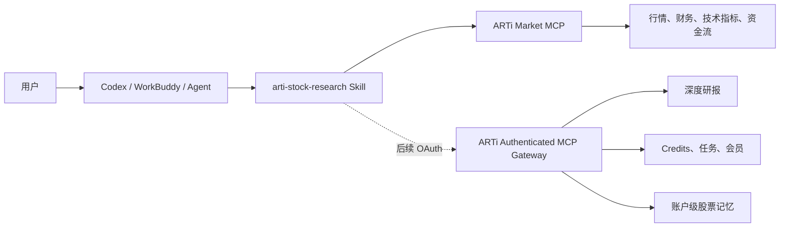

# ARTi 单股研究 Skill

面向 Codex、WorkBuddy 及其他兼容 Agent Skills / `SKILL.md` 的智能体工具，为单只股票研究提供 ARTi 行情、财务、技术指标、资金流、研报证据、额度与用户记忆工作流。

> 当前版本已经接入公开的 ARTi Market MCP，可用于市场数据和基础研究。OAuth 登录、ARTi Credits、付费深度研报和账户级私有记忆已定义好交互规范，但仍需 ARTi Authenticated MCP Gateway 上线后才能真正使用。

## Alpha CLI 与 Codex 插件包

本仓库同时收录 `arti-skills-v0.1.0-alpha-test` 的完整发布内容。根目录 `SKILL.md`、`agents/` 与 `references/` 保留现有 MCP 工作流；`plugins/arti-stock-research/` 提供独立的 Alpha CLI/插件工作流，服务端可用性以实际联调结果为准。

- [Alpha 安装与使用说明](docs/alpha-cli-guide.md)
- [插件与 CLI 源码](plugins/arti-stock-research/)
- [安装脚本](install.sh)、[隐私说明](PRIVACY.md)、[MIT 许可证](LICENSE)
- [市场提交说明](docs/marketplace-submission.md)

本地验证：`bash -n install.sh`、`bash -n plugins/arti-stock-research/skills/arti-stock-research/scripts/arti`、`node --test scripts/arti-credits.test.mjs`。

## 主要能力

- 解析 A 股、港股和美股公司名称、代码及交易所。
- 查询行情快照、日 K、分时、技术指标和交易规则。
- 查询公司资料、三大财务报表和分红记录。
- 在数据源支持时分析个股资金流及市场环境。
- 区分事实、推断、用户记忆和证据缺口。
- 对比用户上次观点与最新证据。
- 区分宿主 Agent Token、ARTi Access Token 和 ARTi Credits。
- 在额度不足时停止付费重试，并展示服务端返回的任务或会员入口。
- 避免把不确定数据包装成实时行情或确定性投资结论。

## 当前能力状态

| 能力 | 状态 | 说明 |
|---|---|---|
| ARTi 市场数据 MCP | 可用 | 已在 `agents/openai.yaml` 中声明依赖 |
| 行情、K 线、技术指标 | 可用 | 实际字段和新鲜度取决于市场及数据源 |
| 公司资料、财务、分红 | 可用 | 港股、美股部分字段可能降级或缺失 |
| A 股资金流和市场概览 | 可用 | 不应套用到港股或美股 |
| 研报来源追踪与验证 | 可用 | 需要已有 ARTi 报告任务 ID |
| Agent 自研模式 | 可用 | ARTi 提供事实，宿主 Agent 完成综合分析 |
| ARTi OAuth 注册/登录 | 待后端接入 | Skill 不会伪造授权链接或要求用户粘贴长期 Token |
| ARTi Credits 查询与扣费 | 待后端接入 | 定价与扣费必须由 ARTi 服务端权威执行 |
| ARTi 付费深度研报 | 待后端接入 | 需要认证后的 `research_stock` 类工具 |
| 账户级股票记忆 | 待后端接入 | 需要认证后的读取、保存和删除工具 |

## 架构



Skill 负责识别意图、选择工具和组织输出；ARTi 服务端负责数据、身份、定价、扣费、退款和记忆隔离。

## 快速安装

### 通用安装命令

需要本机已安装 Node.js/npm：

```bash
npx skills add huangxm129/arti-skill
```

安装器会下载本仓库，并根据其支持情况配置到所选 Agent。`skills` CLI 的行为和支持平台以其[当前文档](https://www.skills.sh/docs/cli)为准。

### 在 Codex 中安装

可以直接让 Codex 的 Skill Installer 从 GitHub 安装：

```text
$skill-installer 从 https://github.com/huangxm129/arti-skill 安装 arti-stock-research
```

也可以手动安装到 Codex 用户级 Skill 目录：

```bash
git clone https://github.com/huangxm129/arti-skill.git \
  "$HOME/.agents/skills/arti-stock-research"
```

Codex 会自动发现新增 Skill；如果没有出现，请重启 Codex。Codex 的目录、触发和依赖元数据说明见[官方 OpenAI 文档](https://learn.chatgpt.com/docs/build-skills)。

### 在 WorkBuddy 或其他 Agent 中安装

优先使用通用安装命令，并在安装器中选择对应 Agent：

```bash
npx skills add huangxm129/arti-skill
```

如果目标 Agent 不支持该 CLI，但支持 Agent Skills / `SKILL.md`：

1. 下载本仓库 ZIP 或克隆仓库。
2. 将整个目录导入目标 Agent 的 Skill 管理界面。
3. 确认 `SKILL.md`、`references/` 和 `agents/openai.yaml` 均被保留。
4. 按目标 Agent 的方式连接 ARTi Market MCP。

不同 Agent 对 `agents/openai.yaml` 和 MCP 自动依赖的支持并不一致，安装成功不等于 MCP 已连接。

## ARTi Market MCP

本 Skill 声明的 MCP 配置为：

| 配置 | 值 |
|---|---|
| 名称 | `arti-market` |
| 传输 | Streamable HTTP |
| MCP URL | `https://mcp-market-production.up.railway.app/mcp` |
| 健康检查 | `https://mcp-market-production.up.railway.app/health` |

如果宿主 Agent 不识别 `agents/openai.yaml` 的工具依赖，需要在宿主的 MCP 设置中手动添加上述服务。

可以先检查服务状态：

```bash
curl -fsS https://mcp-market-production.up.railway.app/health
```

预期返回：

```json
{"status":"ok","service":"mcp-market"}
```

## 如何触发 Skill

### 显式触发

在 Codex 中直接提及 Skill：

```text
使用 $arti-stock-research 研究贵州茅台，给我基本面、技术面、风险和证据缺口。
```

### 隐式触发

当宿主支持隐式 Skill 匹配时，以下请求可以自动触发：

```text
分析一下 600519.SS 最近的基本面和技术走势。
```

```text
查询腾讯控股 0700.HK 的最新行情、财务和主要风险。
```

```text
研究 NVDA，区分事实和推断，不要给确定性的买卖建议。
```

如果没有自动触发，请使用 `$arti-stock-research` 显式调用。

## 使用示例

### 快速行情

```text
使用 $arti-stock-research 查询贵州茅台最新行情，标注数据时间、市场状态和缓存信息。
```

### 完整单股研究

```text
使用 $arti-stock-research 研究宁德时代：
1. 公司与业务
2. 收入、利润、现金流和资产负债
3. 估值与技术面
4. 资金行为
5. 催化剂、风险与证据缺口
```

### 港股或美股

```text
使用 $arti-stock-research 分析 NVDA。只使用该市场实际支持的数据，缺失字段不要用 A 股数据替代。
```

### 财务专项

```text
使用 $arti-stock-research 分析 600519.SS 最近几期利润表、资产负债表和现金流量表，指出趋势和异常。
```

### 技术面专项

```text
使用 $arti-stock-research 分析 0700.HK 的价格趋势、波动和技术指标。把关键位置写成观察条件，不要直接下买卖指令。
```

### 研报证据复核

```text
使用 $arti-stock-research 检查 ARTi 报告任务 <task-id> 的数据来源、阻断字段和证据追踪。
```

### 记忆与观点对比（后端接入后）

```text
使用 $arti-stock-research 读取我上次对 NVDA 的观点，对比最新证据，并告诉我哪些判断发生了变化。
```

```text
记住我对 NVDA 的观点：未来两个季度重点关注数据中心收入增速、毛利率和资本开支风险。
```

Skill 只会在用户明确表达“记住、关注、跟踪”或确认保存时写入账户记忆。

## 两种研究模式

### Agent 自研模式

适用于行情查询、快速分析、特定维度研究和普通单股研究：

1. ARTi MCP 返回结构化市场事实。
2. 宿主 Agent 组织证据并生成分析。
3. 主要消耗宿主 Agent Token；ARTi 数据调用遵循服务端声明的策略。

这是当前可用的主要模式。

### ARTi 深度研究模式

适用于用户明确请求深度、完整或付费研报，并且认证后的 ARTi 研究工具已经可用：

1. ARTi 服务端确认登录状态和研究权限。
2. ARTi 服务端返回权威成本或套餐权益。
3. ARTi 服务端执行研究、扣除 Credits，并在失败时退款。
4. 宿主 Agent 展示结果并继续消耗少量编排 Token。

Skill 不会硬编码研究价格，也不会因为免费工具失败而自动切换到付费工具。

## Token、登录凭证与 Credits

| 名称 | 含义 | 由谁管理 |
|---|---|---|
| 宿主 Agent Token | 理解问题、调用工具和生成回答所消耗的模型用量 | Codex、WorkBuddy 或其他宿主 |
| ARTi Access Token | OAuth 登录凭证，不是可消费余额 | ARTi 身份系统及宿主安全存储 |
| ARTi Credits | 深度研究等 ARTi 付费能力使用的额度 | ARTi 服务端账本 |

即使使用 ARTi 深度研究，宿主 Agent 仍会消耗少量 Token 来完成工具调用和结果展示。

### 登录流程（后端接入后）

1. Skill 调用受保护的 ARTi 工具。
2. ARTi 返回短时有效的授权链接以及可选二维码信息。
3. 用户通过链接或扫码完成注册、登录和授权。
4. 宿主安全保存 OAuth 凭证并恢复原研究请求。

Skill 不应要求用户在对话中粘贴密码、私钥、Service Role Key 或长期 Access Token。

### Credits 不足（后端接入后）

当 ARTi 返回 `insufficient_credits` 或 HTTP 402 时，Skill 会：

1. 停止本次付费调用及自动重试。
2. 展示服务端返回的所需额度与当前额度。
3. 展示服务端返回的“做任务赚额度”或“购买会员”等入口。
4. 在事实工具仍可用时，询问用户是否改用 Agent 自研模式。

Skill 不会猜测任务页、会员页或支付页 URL。

## 研究输出结构

完整研究通常包含：

1. 研究对象、标准代码、交易所、币种和数据时间。
2. 三至五条结论摘要。
3. 行情和估值快照。
4. 业务与基本面分析。
5. 技术面与资金行为。
6. 催化剂和风险。
7. 历史记忆对比（可用时）。
8. 数据失败、陈旧字段和市场不支持项。
9. 能够强化或证伪当前判断的后续观察条件。

Skill 使用以下证据标签：

- `事实`：工具或数据源直接返回。
- `推断`：基于已列事实进行的推理。
- `用户记忆`：用户此前明确保存或确认的观点。
- `缺口`：不可用、过期、冲突或不支持的数据。

## 主要工具

当前 ARTi Market MCP 包含以下单股研究能力：

- `load_stock_context`：聚合单股上下文，适合完整研究的首次调用。
- `get_realtime_quote`：行情快照。
- `get_minute_bars`、`get_daily_bars`：分时和历史日 K。
- `get_technical_indicators`：技术指标。
- `get_stock_info`、`get_company_profile`：身份和公司资料。
- `get_financial_report`：利润表、资产负债表和现金流量表。
- `get_dividend_history`：历史分红。
- `get_stock_fund_flow`：个股资金流，主要面向 A 股。
- `get_trading_rules`：市场交易规则。
- `get_report_data_review`、`get_report_data_trace`、`validate_report_sources`：ARTi 报告证据复核。

详细选择规则见 [`references/tool-routing.md`](references/tool-routing.md)。

## 市场和数据边界

- A 股专属的北向资金、龙虎榜、融资融券或市场概览不能直接套用到港股和美股。
- 港股、美股的本地 fallback 可能与 ARTi 内部数据路由存在字段质量差异。
- 必须保留返回数据的币种、单位、时区、财务期间和复权方式。
- 只有返回元数据明确支持时才能称为“实时”。
- 单个工具失败时，Skill 应保留已成功获取的证据，并列出缺失维度。

## 常见问题

### 安装后找不到 Skill

- 在 Codex 中运行 `/skills` 或输入 `$` 搜索 `arti-stock-research`。
- 确认安装目录中直接存在 `SKILL.md`。
- 重启宿主 Agent。
- 避免同时安装多个同名 Skill 副本。

### Skill 已触发，但没有 ARTi 工具

- 检查宿主是否支持 `agents/openai.yaml` 的 MCP 依赖。
- 手动添加 `https://mcp-market-production.up.railway.app/mcp`。
- 访问健康检查确认服务在线。
- 检查宿主的网络权限和 MCP 工具授权。

### 为什么没有出现 ARTi 登录或二维码？

当前公开 MCP 主要提供市场数据。OAuth 注册、扫码登录和账户绑定需要 Authenticated MCP Gateway，上线前不会出现登录流程。

### 为什么查不到 Credits 或历史记忆？

Credits 与私有记忆属于账户级能力，需要认证后的 ARTi Gateway。Skill 已包含交互和安全规则，但不会用本地文件或虚假数据替代。

### 为什么某些港股或美股字段为空？

数据源和市场支持范围不同。Skill 会保留缺失状态，不应拿 A 股近似字段静默替换。

### 为什么行情不是实时的？

请检查交易时段、返回时间、缓存元数据、数据源状态和是否发生 fallback。不要仅凭回答生成时间判断行情新鲜度。

## 仓库结构

```text
arti-skill/
├── README.md
├── SKILL.md
├── agents/
│   └── openai.yaml
└── references/
    ├── credits-auth-memory.md
    ├── output-contract.md
    └── tool-routing.md
```

- `SKILL.md`：Agent 执行单股研究时加载的核心指令。
- `agents/openai.yaml`：Codex/ChatGPT UI 元数据和 ARTi MCP 依赖。
- `references/`：按需加载的工具、额度、记忆与输出规则。
- `README.md`：面向安装者和使用者的完整介绍与使用说明。

## 隐私与安全

- 不要把 ARTi 服务端密钥、Supabase Service Role Key 或数据供应商密钥提交到 Skill 仓库。
- 不要在对话中发送长期 Access Token、密码、私钥或支付信息。
- 定价、扣费、幂等和失败退款必须由产生结果的 ARTi 服务端处理。
- 账户记忆只能保存用户明确表达或确认的股票观点。
- 用户要求删除或关闭记忆时，应调用对应的 ARTi 删除能力，不保留静默副本。

## 投资与数据声明

本项目用于信息检索、证据整理和研究辅助，不构成个性化证券投资建议，不执行交易，也不承诺收益。模型输出和数据源均可能存在延迟、缺失或错误；投资决策应由用户结合自身情况独立作出。

实时行情、交易所数据和其他商业数据可能受到展示、缓存、衍生使用及再分发许可限制。部署方应自行确认数据供应商协议和适用监管要求。

## 相关链接

- [GitHub 仓库](https://github.com/huangxm129/arti-skill)
- [Skill 核心指令](SKILL.md)
- [工具路由](references/tool-routing.md)
- [认证、Credits 与记忆规则](references/credits-auth-memory.md)
- [研究输出规范](references/output-contract.md)
- [OpenAI 官方 Build Skills 文档](https://learn.chatgpt.com/docs/build-skills)
- [Agent Skills CLI 文档](https://www.skills.sh/docs/cli)
